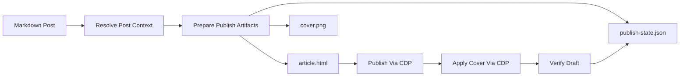

# WeChat CLI Toolbox Design

**Date:** 2026-04-22

**Status:** Draft for review

## Goal
为当前博客仓库沉淀一套可重复使用的微信公众号发布 CLI 工具箱，覆盖准备产物、发布草稿、补封面、校验结果和失败重试的完整流程，并尽量复用已经跑通的现有脚本。

## Scope

### In Scope
- 提供统一 CLI 入口和子命令：`prepare`、`publish`、`cover`、`verify`、`retry`、`all`
- 默认面向 `content/posts/*.md` 文章
- 自动生成 WeChat-safe HTML
- 自动处理含公式文章的公式图片导出
- 通过浏览器/CDP 发到公众号草稿箱
- 通过浏览器/CDP 补封面
- 对当前草稿进行基本质量校验
- 持久化发布状态，支持失败恢复和断点重试

### Out of Scope
- 多账号公众号管理
- GUI 或网页控制台
- 自动生成封面图
- 直接发表/群发
- 复杂状态机或队列调度

## Design Summary
采用“统一 CLI 入口 + `scripts/wechat/*` 分模块实现 + `.wechat-preview/<slug>/` 工作目录 + `publish-state.json` 状态持久化”的方案。

核心原则：
- 约定优先，平时只需要传文章路径
- 失败后尽量局部重试，不重复做已成功步骤
- 每篇文章的发文产物、状态和调试信息集中落在一个目录
- 尽量复用已存在的导出与 CDP 发布能力，避免再产生临时脚本堆积

## User-Facing Commands

统一入口：

```bash
npm run wechat -- <subcommand> --post content/posts/example.md
```

子命令定义：

- `prepare`
  - 解析文章上下文
  - 生成 `article.html`
  - 解析/复制封面
  - 初始化或更新状态文件
- `publish`
  - 将正文发布到公众号草稿编辑器
  - 保存草稿
  - 记录正文字数等结果
- `cover`
  - 在当前草稿页应用封面
  - 保存草稿
- `verify`
  - 校验标题、正文、封面、公式残留、图片节点
  - 输出结构化结果并写回状态文件
- `retry`
  - 读取状态文件，从最后一个失败步骤继续执行
- `all`
  - 顺序执行 `prepare -> publish -> cover -> verify`
  - 自动跳过未失效的成功步骤

兼容入口保留：
- `npm run wechat:export`
- `npm run wechat:draft`

后续内部可逐步改为调用统一 CLI，避免逻辑分叉。

## Conventions

### Input
- 默认输入为 `content/posts/*.md`
- 必传参数：`--post <markdown>`

### Work Directory
每篇文章的工作目录固定为：

```text
.wechat-preview/<slug>/
```

默认产物：

```text
.wechat-preview/<slug>/
  article.html
  cover.png
  publish-state.json
  run.log
  artifacts/
```

### Cover Resolution
封面解析优先级：
1. CLI `--cover`
2. frontmatter：`coverImage` / `featureImage` / `cover` / `image`
3. 文章目录下默认 `imgs/cover.png`
4. 已存在的 `.wechat-preview/<slug>/cover.png`

如果最终仍然没有封面，则：
- `prepare` 标记封面缺失
- `all` 在执行 `cover` 前失败并给出明确提示

## State File

状态文件位置：

```text
.wechat-preview/<slug>/publish-state.json
```

建议结构：

```json
{
  "postPath": "content/posts/example.md",
  "slug": "example",
  "title": "Example Title",
  "workDir": ".wechat-preview/example",
  "htmlPath": ".wechat-preview/example/article.html",
  "coverPath": ".wechat-preview/example/cover.png",
  "steps": {
    "prepare": { "status": "success", "startedAt": "", "finishedAt": "", "error": null },
    "publish": { "status": "success", "startedAt": "", "finishedAt": "", "error": null },
    "cover": { "status": "failed", "startedAt": "", "finishedAt": "", "error": "图片不能为空" },
    "verify": { "status": "pending", "startedAt": null, "finishedAt": null, "error": null }
  },
  "verifyResult": {
    "titleMatches": true,
    "wordCount": 2792,
    "hasCover": true,
    "hasLatexText": false,
    "formulaImageCount": 104,
    "imageCount": 104
  },
  "draftContext": {
    "editorUrl": "",
    "lastUpdatedAt": ""
  }
}
```

要求：
- `status` 只允许 `pending | running | success | failed`
- 每一步开始前写入 `running`
- 每一步结束后必须写入 `success` 或 `failed`
- 错误信息保留原始消息，方便排查

## Execution Rules

### `prepare`
- 若 `article.html` 不存在，必须重新生成
- 若 Markdown 内容或封面文件变更，应视为缓存失效并重新生成
- 复用现有公式导出链路

### `publish`
- 只负责正文和摘要，不处理封面
- 成功后记录正文字数、编辑页 URL 等上下文
- 失败时保留现场，不主动清理

### `cover`
- 只负责封面选择、裁剪确认和保存
- 若封面缺失则直接失败，不继续
- 若当前草稿页不存在，则提示先执行 `publish`

### `verify`
默认检查：
- 标题是否匹配
- 正文字数是否大于 0
- 是否存在封面预览图
- 是否存在 `图片不能为空`
- 是否残留明显 LaTeX 文本，如 `$$`、`\theta`、`\min`
- 图片节点数是否大于 0

### `retry`
恢复规则：
- `prepare` 失败：重新跑 `prepare`
- `publish` 失败：只重跑 `publish`
- `cover` 失败：只重跑 `cover`
- `verify` 失败：
  - 正文为空 -> 自动建议重跑 `publish`
  - 封面缺失 -> 自动建议重跑 `cover`
  - 残留 LaTeX -> 自动建议回到 `prepare`

### `all`
默认执行：

```text
prepare -> publish -> cover -> verify
```

跳过规则：
- 步骤状态为 `success` 且输入未失效时可跳过
- `--force` 时全部重跑

## Module Layout

### New Files
- `scripts/wechat-cli.ts`
  - 统一 CLI 入口
  - 解析命令和参数
  - 调度步骤
- `scripts/wechat/resolve-post-context.ts`
  - 解析 `postPath`、`slug`、`title`、工作目录、封面路径
- `scripts/wechat/state-store.ts`
  - 读写状态文件
  - 更新步骤状态
- `scripts/wechat/prepare-publish-artifacts.ts`
  - 准备 `article.html`、`cover.png`、日志目录
- `scripts/wechat/apply-cover-via-cdp.ts`
  - 正式封装补封面流程
- `scripts/wechat/verify-draft.ts`
  - 校验当前草稿页

### Existing Files To Reuse
- `scripts/wechat/export-wechat-html.ts`
- `scripts/wechat/publish-via-cdp.ts`
- `scripts/content-pipeline.ts`

### Existing Files To Adjust
- `scripts/export-wechat-html.ts`
  - 保持为兼容入口，内部复用新上下文
- `scripts/publish-wechat-article.ts`
  - 保持为兼容入口，内部走统一逻辑
- `package.json`
  - 新增统一 `wechat` 命令

## Data Flow



## Error Handling

要求：
- CLI 输出必须明确告诉用户失败在哪一步
- 所有步骤都要把错误写回 `publish-state.json`
- 失败后不删除工作目录，便于人工排查
- `verify` 的失败要区分“正文问题”“封面问题”“公式问题”
- 对浏览器/CDP 失败，优先提示可重试，而不是直接全流程重跑

## Testing Strategy

测试分层：

### Automated Tests
- 扩展现有 `scripts/wechat-export.test.ts`
- 新增 CLI/状态层测试，覆盖：
  - 状态文件初始化
  - 失败步骤恢复选择
  - `all` 的跳过逻辑
  - 封面解析优先级
  - 校验规则对 LaTeX 残留和空正文的判定

### Manual Verification
以 `content/posts/from-linear-fitting-to-deep-learning.md` 作为回归样本：
- 跑 `prepare`，确认产物目录完整
- 跑 `publish`，确认正文字数大于 0
- 跑 `cover`，确认封面存在且无错误提示
- 跑 `verify`，确认无 LaTeX 残留
- 跑 `all`，确认整链可重复执行
- 人工制造失败状态后跑 `retry`，确认只从失败步骤继续

## Success Criteria
- 日常发布只需要记住一个统一入口 `npm run wechat -- all --post ...`
- 出现失败时可以通过 `retry` 继续，不需要重跑全部步骤
- 每篇文章的发布产物和状态集中在 `.wechat-preview/<slug>/`
- 工具箱不再依赖临时调试脚本才能补封面或校验结果
- 当前含公式文章能够稳定发布到草稿箱，并通过封面和公式校验

## Risks
- 微信后台 DOM 结构变化会影响浏览器自动化
- 封面流程对弹窗和按钮文案较敏感
- 现有外部 skill 与仓库内逻辑可能在一段时间内并存

对应策略：
- 关键选择器集中在 `scripts/wechat/*` 模块中管理
- 失败时保留上下文和状态文件，方便快速修补
- 兼容入口短期保留，逐步迁移到统一 CLI
